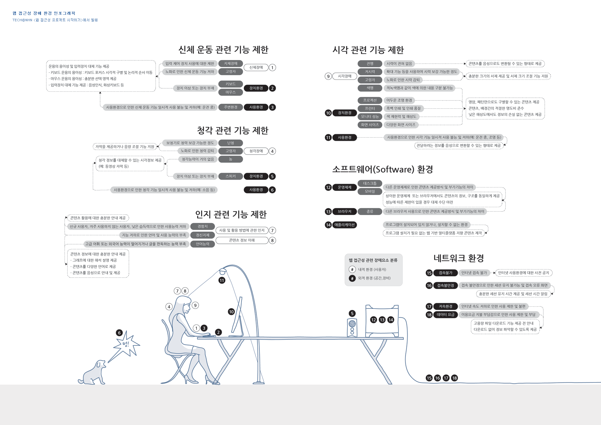

# HTML 공부 겸 과제

## Day1

1. dropdown을 css만으로 구현
  * 1,2은 같은 markup으로
2. dropdown을 jquery만으로 구현
3. 위의 결과를 웹 접근성에 맞게 구현

###웹 접근성이란?
> 어떠한 사용자(장애인, 노인 등), 어떠한 기술환경에서도 사용자가 전문적인 능력 없이 웹 사이트에서 제공하는 모든 정보에 접근할 수 있도록 보장하는 것.
> 장애인 차별법
> 국제 표준(WAI)
> 스크린 리더
> 

